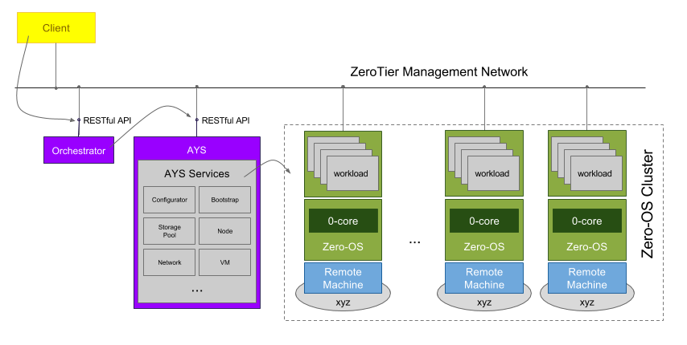
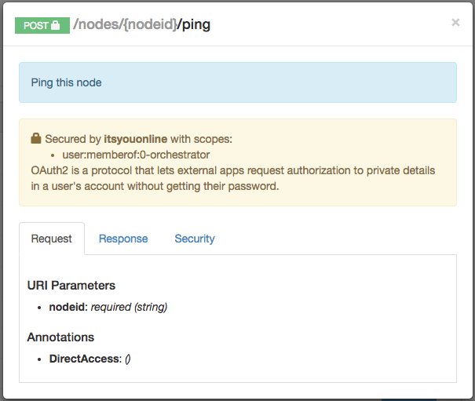
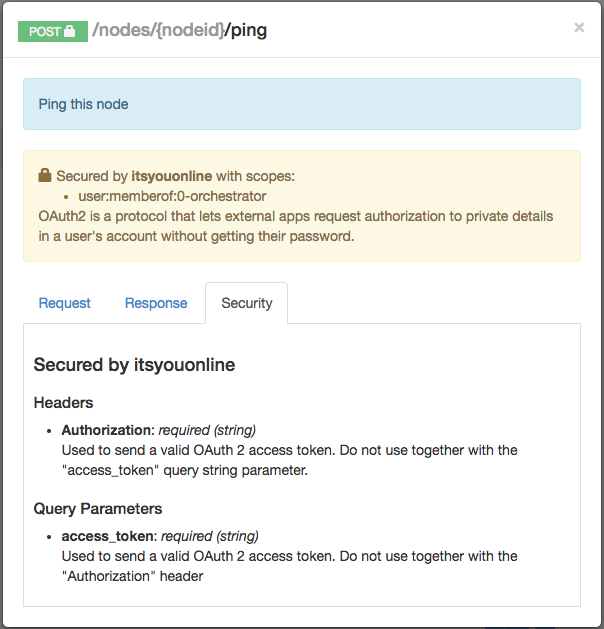

# Zero-OS Orchestrator RESTful API

The Zero-OS Orchestrator exposes all the RESTful APIs to manage the Zero-OS cluster.



See [Zero-OS Orchestrator RESTful API documentation](https://htmlpreviewer.github.io/?../../raml/api.html) for all the available RESTful API endpoints exposed by the Zero-OS Orchestrator.

For each of the methods you'll see the expected request body and response, e.g. for the `ping` method:



On the security tab you'll see that the API is secured by ItsYou.online:



The ItsYou.online integration is enabled as part of a typical Zero-OS cluster setup, as documented in [Setup a Zero-OS Cluster](../setup/README.md).

Interacting with the RESTful APIs of both the AYS server and the Orchestrator require the same JWT.

> For more information on how to configure AYS see [AYS Configuration](https://github.com/Jumpscale/ays9/blob/master/docs/configuration.md).

The API will only accept JWTs that are valid for maximum 1 hour (3600 seconds). Otherwise the API will reject the token (440) due to having an expiration date that is too late. This is to make sure that users that have been  removed from an ItsYou.online organization lose their access as fast as possible. 

Creating a JWT can be done using the AYS command line tool:
```bash
ays generatetoken --clientid '{CLIENT_ID}' --clientsecret '{CLIENT_SECRET}' --organization '$ITSYOUONLINEORG' --validity 3600
```

Alternativelly you can also generate the JWT using the Zero-OS Python client:
```python
from zeroos.orchestrator.client import oauth2_client_itsyouonline

cls = oauth2_client_itsyouonline.Oauth2ClientItsyouonline() # this class can take different urls to authenticate with but defaults to https://itsyou.online/v1/oauth/access_token?response_type=id_token

response = cls.get_access_token(<client id>, <client secret>, scopes=['user:memberof:<organization name>'], audiences=[]) # at the moment only the scope type organization:memberof:<organization_name> is supported

print(response.content)
```

To use the token in the HTTP requests pass it as follows:
```
Authorization: Bearer <**JWT**>
GET http://127.0.0.1:8080/nodes
```

Response:
```json
[
 {
   "hostname": "core0node",
   "id": "525400123456",
   "status": "running"
 }
]
```

To pass the JWT using the Python client :
```python
from zeroos.orchestrator.client import APIClient

test = APIClient("<orchestrator ip >:5000")
test.set_auth_header("Bearer <JWT token>")
```

For all the DELETE APIs, we return 204 if the resource doesn't exist.

The following are some examples on how to use the RESTful API:

- [List all Zero-OS nodes](#list-nodes)
- [Get memory information of a node](#memory-info)
- [Reboot a node](#reboot-node)
- [List containers of node](#list-containers)
- [Create a new container](#create-container)
- [List jobs on a container](#list-jobs)
- [Kill a job](#kill-job)
- [List processes on a container](#list-processes)
- [Start a process on a container](#start-process)

In all below examples we will assume that the Zero-OS Orchestrator is listening on 127.0.0.1:8080.

<a id="list-nodes"></a>
## List all Zero-OS nodes

Using the Zero-OS Orchestrator listening on 127.0.0.1:8080:
```
GET http://127.0.0.1:8080/nodes
```

Response:
```json
[
	{
		"hostname": "cpu-05",
		"id": "0cc47aab6702",
		"ipaddress": "10.147.19.18",
		"status": "running"
	},
	{
		"hostname": "cpu-10",
		"id": "0cc47a3b3d6a",
		"ipaddress": "10.147.19.31",
		"status": "running"
	}
]
```

<a id="memory-info"></a>
## Get memory information of a node

For node 0cc47aab6702:
```
GET http://127.0.0.1:8080/nodes/0cc47aab6702/mem
```

Response:
```json
[
  {
   "active": 197136384,
   "available": 1454743552,
   "buffers": 0,
   "cached": 372428800,
   "free": 1521983488,
   "inactive": 323203072,
   "total": 2102710272,
   "used": 647966720,
   "usedPercent": 30.815787064362617,
   "wired": 0
  }
]
```


<a id="reboot-node"></a>
## Reboot a node

For node 525400123456:
```
POST http://127.0.0.1:8080/nodes/525400123456/reboot
```

Response: `204 No Content`


<a id="list-containers"></a>
## List containers of node

For node 525400123456:

```
GET http://127.0.0.1:8080/nodes/525400123456/containers
```

Response:
```json
[
  {
    "flist": "http://192.168.20.132:8080/deboeckj/lede-17.01.0-r3205-59508e3-x86-64-generic-rootfs.flist",
    "hostname": "vfw_21",
    "id": "vfw_21",
    "status": "running"
  }
]
```


<a id="create-container"></a>
## Create a new container

For node 525400123456:
```
POST http://127.0.0.1:8080/nodes/525400123456/containers
```

Payload:
```json
{
  "nics":[
    {
      "config":{
        "dhcp":false,
        "cidr":"192.168.57.217/24",
        "gateway":"192.168.57.254",
        "dns":[
          "8.8.8.8"
        ]
      },
      "id":"0",
      "type":"vlan"
    }
  ],
  "id":"vfw_22",
  "filesystems":[

  ],
  "flist":"http://192.168.20.132:8080/deboeckj/lede-17.01.0-r3205-59508e3-x86-64-generic-rootfs.flist",
  "hostNetworking":false,
  "hostname":"vfw_22",
  "initprocesses":[

  ],
  "ports":[

  ]
}
```

Response: `204 No Content`


<a id="list-jobs"></a>
## List jobs on a container

For container vfw_22:
```
GET http://127.0.0.1:8080/nodes/525400123456/containers/vfw_21/jobs
```

Response:
```json
[
 {
   "id": "f3976780-f369-45df-ab54-206149dc000e",
   "startTime": 1491984742526
 }
]
```


<a id="kill-job"></a>
## Kill a job

For job f3976780-f369-45df-ab54-206149dc000e on container vfw_21:

```
DELETE http://127.0.0.1:8080/nodes/525400123456/containers/vfw_21/jobs/f3976780-f369-45df-ab54-206149dc000e
```

Response: `204 No Content`


<a id="list-processes"></a>
## List processes on a container

For container vfw_22:
```
GET http://127.0.0.1:8080/nodes/525400123456/containers/vfw_22/processes
```

Response:
```json
[
  {
    "cmdline": "/coreX -core-id 10 -redis-socket /redis.socket -reply-to corex:results -hostname vfw_22",
    "cpu": {
      "guestnice": 0,
      "idle": 0,
      "iowait": 0,
      "irq": 0,
      "nice": 0,
      "softirq": 0,
      "steal": 0,
      "stolen": 0,
      "system": 0,
      "user": 0.04
    },
    "pid": 1,
    "rss": 3399680,
    "swap": 0,
    "vms": 8163328
  }
]
```


<a id="start-process"></a>
## Start a process on a container

For container vfw_22:
```
POST http://127.0.0.1:8080/nodes/525400123456/containers/vfw_22/processes
```

Payload:
```json
{
   "name": "/bin/dnsmasq",
   "pwd": "",
   "args": ["--conf-file=/etc/dnsmasq.conf", "-d"],
   "env": []
}
```

Response: `202 Accepted`
