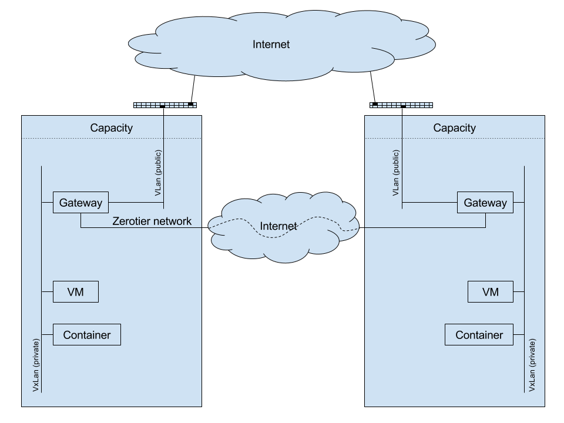

## Zero-OS Gateway

Discussed here:
- [What is the Gateway?](#what-is-the-Gateway)
- [DHCP service](#dhcp-service)
- [Port forwarding](#port-forwarding)
- [Reverse proxying](#reverse-proxying)
- [Advanced modus](#advanced-modus)
- [Cloud-init](#cloud-init)
- [V(x)Lan to V(x)Lan bridge](#vxlan-to-vxlan-bridge)

## What is the Gateway?

The Gateway is the networking Swiss army knife of the Zero-OS stack. It provides the following functions towards private V(X)LANs:
- DHCP service for handing out networking configuration to containers and virtual machines
- A firewalled public IP address
- Internet connectivity towards the containers and virtual machines in the VXLANs
- Port forwarding public IP traffic to hosted resources in the VXLAN
- Reverse proxying HTTP & HTTPS to hosted containers and virtual machines in the connected VXLANs
- Cloud-init server to initiate new virtual machines with passwords, SSH keys, configure swap, ...
- An OSI layer 2 bridge between remote VXLANs spread over different Zero-OS clusters

A Gateway supports a mix of up to 100 network interfaces on VXLANs, VLANs, ZeroTier networks and bridges.
- V(X)LAN networks need to have distinct subnets, and will be routed automatically by the Gateway
- Routing configuration of connected ZeroTier networks needs to be handled in ZeroTier, as well as allowing the Gateway into the ZeroTier network (In case of a private ZeroTier network, when the token is not provided along with the ZeroTier network ID)

## Listing, creating and deleting Gateways
Zero-OS Gateways are managed through the RESTful API exposed by the Zero-OS Orchestrator:
- [List all Gateways](https://htmlpreviewer.github.io/?https://raw.githubusercontent.com/zero-os/0-orchestrator/master/raml/api.html#nodes__nodeid__gws_get)
- [Get Gateway details](https://htmlpreviewer.github.io/?https://raw.githubusercontent.com/zero-os/0-orchestrator/master/raml/api.html#nodes__nodeid__gws__gwname__get)
- [Creating a Gateway](https://htmlpreviewer.github.io/?https://raw.githubusercontent.com/zero-os/0-orchestrator/master/raml/api.html#nodes__nodeid__gws_post)
- [Update a Gateway](https://htmlpreviewer.github.io/?https://raw.githubusercontent.com/zero-os/0-orchestrator/master/raml/api.html#nodes__nodeid__gws__gwname__put)
- [Delete a Gateway](https://htmlpreviewer.github.io/?https://raw.githubusercontent.com/zero-os/0-orchestrator/master/raml/api.html#nodes__nodeid__gws__gwname__delete)

## V(x)LAN to V(x)LAN bridge
Probably the coolest feature of the Gateway. It allows to connect V(X)LANs in remote sites into one logical L2 network using a specially configured ZeroTier network. See [Bridging Remote VXLANs](bridgingVXLANS.md) for detailed information on how to configure the ZeroTier network.
The bridge can be configured by setting the `zerotierbridge` property of the V(X)LAN interface of the Gateway, using the RESTful API methods discussed above.

## DHCP service
After the Gateway has been created, additional hosts can be added, deleted and updated using same the RESTful API:
- [List all DHCP hosts](https://htmlpreviewer.github.io/?https://raw.githubusercontent.com/zero-os/0-orchestrator/master/raml/api.html#nodes__nodeid__gws__gwname__dhcp__interface__hosts_get)
- [Adding a DHCP host](https://htmlpreviewer.github.io/?https://raw.githubusercontent.com/zero-os/0-orchestrator/master/raml/api.html#nodes__nodeid__gws__gwname__dhcp__interface__hosts_post)
- [Remove a DHCP host](https://htmlpreviewer.github.io/?https://raw.githubusercontent.com/zero-os/0-orchestrator/master/raml/api.html#nodes__nodeid__gws__gwname__dhcp__interface__hosts__macaddress__delete)

## Cloud-init
The Gateway also acts as a cloud-init server over HTTP. For more information on cloud-init see https://cloud-init.io/ &&  https://cloudinit.readthedocs.io. The Gateway implements the [Amazon EC2](http://cloudinit.readthedocs.io/en/latest/topics/datasources/ec2.html) data source.

When adding a DHCP host, as discussed above, you can pass the YAML formated cloud-init user-data and meta-data to the `cloudinit` parameter. Many configuration examples can be found here: https://cloudinit.readthedocs.io/en/latest/topics/examples.html

## Port forwarding
Exposing TCP/UDP based services hosted in the connected V(X)LAN networks is achieved via the port forwarding service of the Gateway, as exposted by its RESTful API:
- [List all port forwards](https://htmlpreviewer.github.io/?https://raw.githubusercontent.com/zero-os/0-orchestrator/master/raml/api.html#nodes__nodeid__gws__gwname__firewall_forwards_get)
- [Create a port forward](https://htmlpreviewer.github.io/?https://raw.githubusercontent.com/zero-os/0-orchestrator/master/raml/api.html#nodes__nodeid__gws__gwname__firewall_forwards_post)
- [Delete a port forward](https://htmlpreviewer.github.io/?https://raw.githubusercontent.com/zero-os/0-orchestrator/master/raml/api.html#nodes__nodeid__gws__gwname__firewall_forwards__forwardid__delete)

## Reverse proxying
The reverse proxy service in the Gateway can be used to expose HTTP/HTTPS services hosted in the connected V(X)LANs. It can do SSL-offloading and act as a load balancer towards multiple HTTP servers:
- [List all HTTP reverse proxies](https://htmlpreviewer.github.io/?https://raw.githubusercontent.com/zero-os/0-orchestrator/master/raml/api.html#nodes__nodeid__gws__gwname__httpproxies_get)
-[Get reverse proxy details](https://htmlpreviewer.github.io/?https://raw.githubusercontent.com/zero-os/0-orchestrator/master/raml/api.html#nodes__nodeid__gws__gwname__httpproxies__proxyid__get)
- [Create a new HTTP reverse proxy](https://htmlpreviewer.github.io/?https://raw.githubusercontent.com/zero-os/0-orchestrator/master/raml/api.html#nodes__nodeid__gws__gwname__httpproxies_post)
- [Remove a reverse proxy](https://htmlpreviewer.github.io/?https://raw.githubusercontent.com/zero-os/0-orchestrator/master/raml/api.html#nodes__nodeid__gws__gwname__httpproxies__proxyid__delete)

## Advanced modus

### nftables
Advanced firewall rules can be configured by just posting the [nftables](https://en.wikipedia.org/wiki/Nftables) configuration file that will be used in the Gateway:
- [Get current firewall rules](https://htmlpreviewer.github.io/?https://raw.githubusercontent.com/zero-os/0-orchestrator/master/raml/api.html#nodes__nodeid__gws__gwname__advanced_firewall_get)
- [Set advanced firewall rules](https://htmlpreviewer.github.io/?https://raw.githubusercontent.com/zero-os/0-orchestrator/master/raml/api.html#nodes__nodeid__gws__gwname__advanced_firewall_post) to find how to use the advanced firewall modus.

> **Important** to note is that when the advanced firewall configuration is set the port forwarding API as discussed above will no longer function.

### Caddy
Advanced reverse proxy configuration can be configured by uploading the [Caddy](https://caddyserver.com/) configuration file onto the Orchestrator API:
- [Get the advanced reverse proxy configuration](https://htmlpreviewer.github.io/?https://raw.githubusercontent.com/zero-os/0-orchestrator/master/raml/api.html#nodes__nodeid__gws__gwname__advanced_http_get)
- [Update the advanced reverse proxy configuration](https://htmlpreviewer.github.io/?https://raw.githubusercontent.com/zero-os/0-orchestrator/master/raml/api.html#nodes__nodeid__gws__gwname__advanced_http_post)

> **Important** to note is that when the advanced reverse proxy configuration is set the reverse proxy API as discussed above will no longer function.
