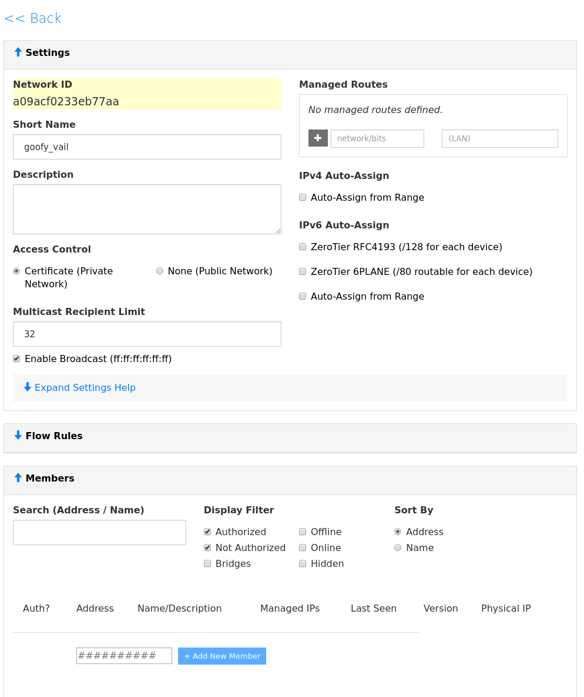

# Bridging Remote VXLANs

How this will work:
  1. Create a ZeroTier network, but without!! allocated route or IP addresses
  1. Have a running Gateway with a public interface and a leg on the VXLAN (PRIV)
  1. Create (maybe foresee it by default) a (Linux) bridge in the Gateway, and attach the PRIV interface to it
  1. Migrate the IP of the PRIV interface to the bridge, and bring the bridge up
  1. Start zerotier-one, join network id
  1. Configure the ZeroTier interface to have config/bridge=true  
  [Specified here](https://github.com/zero-os/zerotier_client/blob/master/api.raml#L359)
  1. Attach zt0 to the bridge

Implementation

  - Create ZeroTier
  


In a Zero-GW:

```bash
#!/bin/bash
ZTID=a09acf0233eb77aa
PUB=eth0
PRIV=eth1
# eth0 has a public ip (routable to Internet)
# eth1 is connected to the vxlan bridge
zerotier-cli join ${ZTID}
# go back to your zerotier-page and set bridge of new client to on (without IP)
```


```bash
#!/bin/bash
ZTID=a09acf0233eb77aa
PUB=eth0
PRIV=eth1
PRIVIP=172.29.1.1/16 (reflect this as deft gw in dnsmasq dhcp config)

ip link add ztbr type bridge
ip link set ${PRIV} master ztbr
ip link set ${PRIV} up
# add zt0 to bridge
ip link set zt0 master ztbr

ip addr add ${PRIVIP} dev ztbr
ip link set ztbr up

```

Now do the same on the other side, but use another range of IP, like 172.29.2.1/16.
