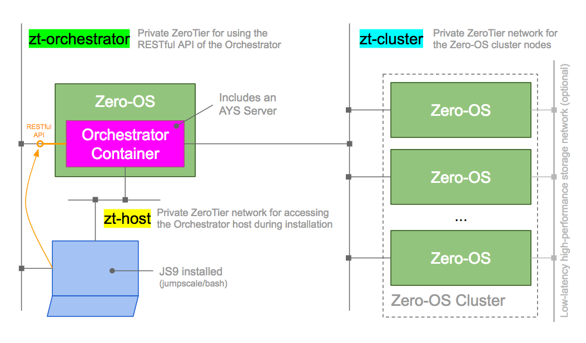
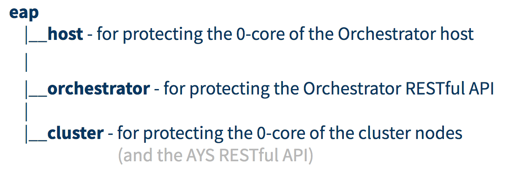

# Setup Zero-OS Orchestrator using Autosetup

## Setup



## ItsYou.online organizations:



## Steps
- [Get JumpScale9](#js9)
- [Setup the ZeroTier host network](#zt-host)
- [Get the Zero-OS image for host](#host-image)
- [Create an application ID and secret](#app-key)
- [Install the latest version of the 0-core Python client](#0-core-client)
- [Install the latest version of the Orchestrator client](#0-orchestrator-client)
- [Prepare/Reset the host](#prep-host)
- [Get the bootstrap installation script](#get-script)
- [Set all needed environment variables](#env-vars)
- [Create the JWTs that need to be passed to the installation script](#create-jwts)
- [Install JOSE](#install-jose)
- [Load private key](#load-key)
- [Dry-run](#dry-run)
- [Actual installation](#actual-installation)
- [Add a first Zero-OS node into the cluster](#first-node)
- [Test the RESTful API](#test-api)


<a id="js9"></a>
## Get JumpScale 9

Check the [developer/bash](ttps://github.com/Jumpscale/bash) repository for instructions on how to setup a JS9 Environment.


<a id="zt-host"></a>
## Create and join ZeroTier network to for connecting to the Orchestrator host

zt-host is the ZT network on which the Orchestrator host is connected; only used during installation

Join it:
```bash
ZT_HOST_ID="17d709436c5bc232"
zerotier-cli join ZT_HOST_ID
```

<a id="host-image"></a>
## Get the Zero-OS image for host

https://bootstrap.gig.tech/ipxe/master/17d709436c5bc232/organization=eap.host


<a id="app-key"></a>
## Create an application ID and secret

Copy this application ID and secret into environment variables, and make sure to export them so you can access them from the JumpScale interactive shell.

```bash
export CLIENT_ID=""
export CLIENT_SECRET=""
```

Also export the name of the ItsYou.online organization you created for protecting the host:
```bash
export ORG_HOST="eap.host"
```

<a id="0-core-client"></a>
## Install the latest version of the 0-core Python client

At the command line:
```bash
cd /opt/code/github/
mkdir Zero-OS
cd zero-os
git clone git@github.com:zero-os/0-core.git
client 0-core/client/py-client/
pip3 install .
```

<a id="0-orchestrator-client"></a>
## Install the latest version of the Orchestrator client

At the command line:
```bash
pip3 install git+https://github.com/zero-os/0-orchestrator.git#subdirectory=pyclient
```

<a id="prep-host"></a>
## Prepare/Reset the host

In the interactive shell first create a JWT to connect to the host:
```python
import os
import requests
params = {
  'grant_type': 'client_credentials',
  'response_type': 'id_token',
  'client_id': os.environ['CLIENT_ID'],
  'client_secret': os.environ['CLIENT_SECRET'],
  'scope': 'user:memberof:{0}'.format(os.environ['ORG_HOST']),
  'validity': 3600
}

url = 'https://itsyou.online/v1/oauth/access_token'
resp = requests.post(url, params=params)
resp.raise_for_status()
jwt = resp.content.decode('utf8')
```

Copy the IP address of the host in the zt-host network - CHECK:
```python
host="10.147.18.113"
```

Optionally, check wether there is already a container on the host, using the 0-core client:
```python
from zeroos.core0.client import Client
cl=Client(host, password=jwt)
cl.ping()
cl.container.list()
```

In case the above shows a container, we will want to delete it first, using the Orchestrator client:
```bash
from zeroos.orchestrator.sal.Node import Node
node = Node(addr=host, timeout=86400, password=jwt)
node.client.container.terminate(1)
node.client.bash("reboot")
node.wipedisks()
node.ensure_persistance()
```

> John Kheir, [Sep 25, 2017, 3:06:21 PM]:
> just one comment if u r working on packet zeroos node
> the main disk should be formated and mounted
> cl.bash('mkfs.btrfs /dev/sda').get()
> cl.bash('mount /dev/sda /var/cache').get()
> so when the autoscript is running it will find enough space on the zeroos host node

Hit `CTRL+Z` in order to suspend your JumpScale interactive shell.


<a id="get-script"></a>
## Get the bootstrap installation script

Get the script:
```bash
cd /tmp
export BRANCH="autosetup-simplification"
curl -o autobootstrap.py https://raw.githubusercontent.com/zero-os/0-orchestrator/${BRANCH}/autosetup/autobootstrap.py
```

<a id="env-vars"></a>
## Set all needed environment variables

```bash
HOST="10.147.18.113"
CONTAINER_NAME="yves.orchestrator"
ZT_ORCHESTRATOR_ID="a09acf023327c179"
GIT_REPO="git@github.com:yveskerwyn/yves-orchestrator.git"
ORCHESTRATOR_ORG="eap.orchestrator"
ZT_CLUSTER_ID="17d709436c7e8f71"
ORCHESTRATOR_ZT_TOKEN=""
CLUSTER_ZT_TOKEN=""
ORG_CLUSTER="eap.cluster"
CLUSTER_CLIENT_ID=$CLIENT_ID
CLUSTER_CLIENT_SECRET=$CLIENT_SECRET
```

<a id="create-jwts"></a>
## Create the JWTs that need to be passed to the installation script

There are two JWTs required:
- JWT_HOST for allowing the installation script to access the host, which is protected by the eap.host organization
- JWT_CLUSTER for allowing the orchestrator to access the cluster nodes, which are protected by the eap.cluster organization

Both JWTs will be created for the same ItsYou.online user.

This ItsYou.online user needs to be member of both eap.host and eap.cluster ItsYou.online organizations.


### JWT_HOST

```bash
HOST_ORG="eap.host"
export VALIDITY_IN_SECONDS=3600
export JWT_HOST=`curl -s -X POST "https://itsyou.online/v1/oauth/access_token?grant_type=client_credentials&client_id=${CLIENTID1}&client_secret=${SECRET1}&response_type=id_token&scope=user:memberof:${HOST_ORG}&validity=${VALIDITY_IN_SECONDS}"`
```

Check:
```bash
echo $JWT_HOST
```

### JWT_CLUSTER - refreshable

This JWT needs to be **refreshable**.

It is used internally by the Orchestrator API server to access the Zero-OS API of the cluster nodes.


```bash
CLUSTER_ORG="eap.cluster"
export VALIDITY_IN_SECONDS=3600
export JWT_CLUSTER=`curl -s -X POST "https://itsyou.online/v1/oauth/access_token?grant_type=client_credentials&client_id=${CLIENTID1}&client_secret=${SECRET1}&response_type=id_token&scope=user:memberof:${CLUSTER_ORG},offline_access&validity=${VALIDITY_IN_SECONDS}"`
```

Check:
```bash
echo $JWT_CLUSTER
```

<a id="install-jose"></a>
## Install JOSE

```bash
pip3 install python-jose
```

<a id="load-key"></a>
## Load private key

```bash
eval `ssh-agent`
ssh-add
```

<a id="dry-run"></a>
## Dry run

> Don't use --cluster-jwt

First do a dry-run, using the `--dry-run` option:
```bash
python3 autobootstrap.py --host $HOST --host-jwt $JWT_HOST --orchestrator-container-name $CONTAINER_NAME --orchestrator-iyo-organization $ORCHESTRATOR_ORG --orchestrator-zt-net $ZT_ORCHESTRATOR_ID --orchestrator-zt-token $ORCHESTRATOR_ZT_TOKEN --orchestrator-git-repo $GIT_REPO --cluster-iyo-organization $ORG_CLUSTER --cluster-iyo-client-id $CLUSTER_CLIENT_ID --cluster-iyo-client-secret $CLUSTER_CLIENT_SECRET --cluster-management-zt-net $ZT_CLUSTER_ID --cluster-management-zt-token $CLUSTER_ZT_TOKEN --cluster-backend-network-type packet --orchestrator-container-flist https://hub.gig.tech/maxux/0-orchestrator-full-node-reboot.flist --dry-run
```

<a id="actual-installation"></a>
## Actual installation

```bash
python3 autobootstrap.py --host $HOST --host-jwt $JWT_HOST --orchestrator-container-name $CONTAINER_NAME --orchestrator-iyo-organization $ORCHESTRATOR_ORG --orchestrator-zt-net $ZT_ORCHESTRATOR_ID --orchestrator-zt-token $ORCHESTRATOR_ZT_TOKEN --orchestrator-git-repo $GIT_REPO --cluster-iyo-organization $ORG_CLUSTER --cluster-iyo-client-id $CLUSTER_CLIENT_ID --cluster-iyo-client-secret $CLUSTER_CLIENT_SECRET --cluster-management-zt-net $ZT_CLUSTER_ID --cluster-management-zt-token $CLUSTER_ZT_TOKEN --cluster-backend-network-type packet --orchestrator-container-flist https://hub.gig.tech/maxux/0-orchestrator-full-node-reboot.flist
```

```bash
fg
```

<a id="first-node"></a>
## Add a first Zero-OS node into the cluster

### Get the ISO image

Download an ISO image from the Bootstrap service:
https://bootstrap.gig.tech/iso/master/17d709436c7e8f71/organization=eap.cluster

Make sure to:
- Request the correct version of the Zero-OS image, here `master`
- Pass correct organization name as a kernel parameter, here the `eap.cluster` organization
- Specify the ID of the zt-cluster network

### VirtualBox

Start a VM with VirtualBox using the downloaded image.


<a id="test-api"></a>
## Test the RESTful API

### Join zt-orchestrator

On the machine from where you want to use the RESTful API of the orchestrator, make sure you have joined the `zt-orchestrator` ZT network, which is the network on which the RESTful API of the Orchestrator wiil be exposed.

Join from my Mac:
```bash
ZT_ORCHESTRATOR_ID="a09acf023327c179"
zerotier-cli join $ZT_ORCHESTRATOR_ID
```

### Insomnia

First get a JWT proving that you are member of the **eap.orchestrator** organization:
```bash
ORCHESTRATOR_ORG="eap.orchestrator"
export VALIDITY_IN_SECONDS=3600
export JWT_ORCHESTRATOR=`curl -s -X POST "https://itsyou.online/v1/oauth/access_token?grant_type=client_credentials&client_id=${CLIENT_ID}&client_secret=${CLIENT_SECRET}&response_type=id_token&scope=user:memberof:${ORCHESTRATOR_ORG}&validity=${VALIDITY_IN_SECONDS}"`
echo $JWT_ORCHESTRATOR
```


WAS - Use a JWT to **represent** the `eap.orchestrator` organization, didn't work:
```bash
CLIENT_ID="eap.orchestrator"
CLIENT_SECRET=""
export VALIDITY_IN_SECONDS=3600
export JWT_ORCHESTRATOR=`curl -s -X POST "https://itsyou.online/v1/oauth/access_token?grant_type=client_credentials&client_id=${CLIENT_ID}&client_secret=${CLIENT_SECRET}&response_type=id_token&validity=${VALIDITY_IN_SECONDS}"`
echo $JWT_ORCHESTRATOR
```
