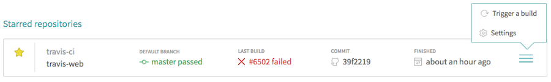

## 0-Orchestrator Testsuite
- Here is the link for the tests: [testsuite](api_testing/testcases)

### 1- Running using Travis
- When travis triggers the python environment, Basically it starts to create number of packet machines  using specific images that matches the branch you are running from, then run the tests on it.
- After the tests are done, packet machines is deleted.

#### How Travis works?
- For this Project, travis is configured to start a matrix to run two different jobs, each using a different environment
- One environment is using go which is always triggered with each commit, the other one is using python and it is always triggered
  but will never run the tests unless it was triggered using scheduled cron jobs or manually (using api).

#### Trigger Manual builds

##### To trigger a manual build using travis, use one of the following ways:

1- Using Travis Dashboard
- Go to [travis-beta-features](https://travis-ci.org/features), and enable the the Dashboard option then a click on the Travis CI logo at the top gets you there!
- Once you are there, you can trigger a manual build as shown in figure. This build is triggered from the default branch


2- Using trigger_travis.sh script
- The advantage of this script is that the build can be triggered from any branch. Here is the script [trigger_travis](trigger_travis.sh)
- For this script to work, a travis token need to be provided. To generate token, you need to install line command travis client [travis-client](https://github.com/travis-ci/travis.rb#installation), then use these commands:
    ```
    travis login --org
    travis token --org
    ```
- For instance, to trigger a build from master branch, the branch "master" and the token should be passed to the script
    ```
    bash trigger_travis.sh master l17-fmjUgycEAcQWWCA
    ```

### 2- Running Manually 

#### Clone this repo 
```bash
git clone https://github.com/0-complexity/G8_testing
```
#### Install requirements
```bash
cd 0-orchestrator/tests/Grid_API_Testing/
pip3 install -r requirements.txt
```
#### Set your configrations
```ini
[main]
api_base_url = #the url of the Zero-OS Cluste
zerotier_token = #zerotier account token
client_id = #itsyouonline account client id
client_secret = #itsyouonline account client secret
organization = #itsyouonline organization

```
> [See how to setup a Zero-OS Cluste](https://github.com/zero-os/0-orchestrator/tree/master/docs/setup)


#### Run tests
```bash
cd 0-orchestrator/tests/Grid_API_Testing/
export PYTHONPATH=./
nosetests -s -v api_testing/testcases --tc-file api_testing/config.ini
```
